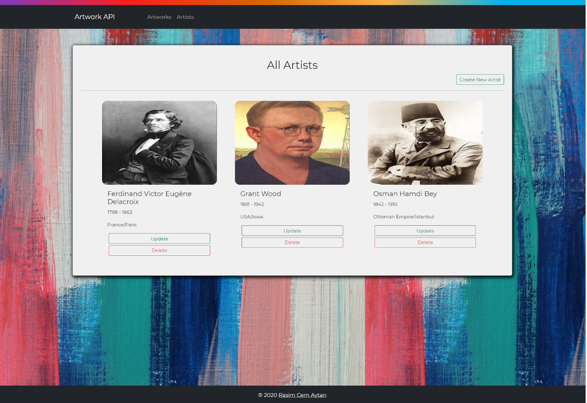
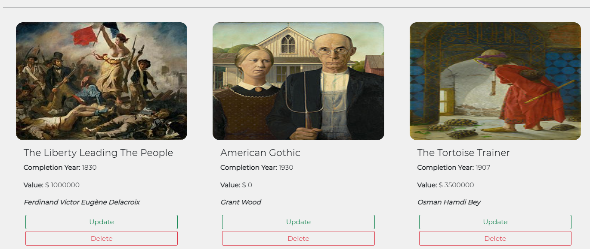
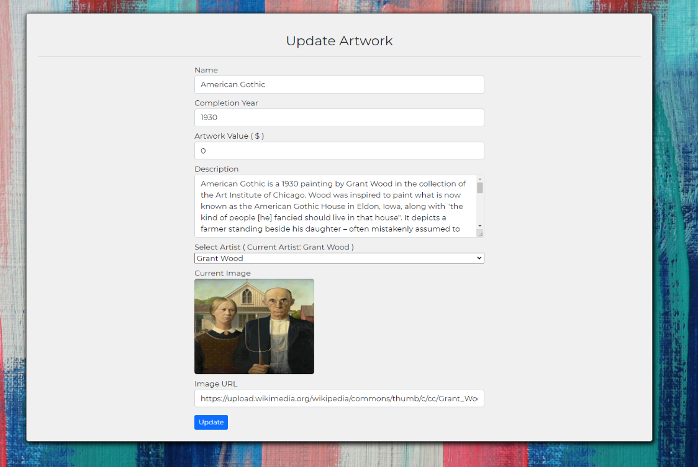

# Spring BOOT Rest API with Vue JS

---
## Description
This web based application developed for the meet **Kodluyoruz Bootcamp** graduation criterias. The Rest API developed using Java Spring Boot framework for this purpose. Vue JS framework used for the User Interface development. Axios used for the API requests. The API developed according to multitier architecture and SOLID principles.

## Getting Started
This application is an example of simple rest API. In the application, popular artworks and their detailed information included. Also, detailed information provided for the artists which is owner of the artworks. These artworks and artists information can be display, edit and remove. There is a obligation which is each artwork has to belong one of the added artists.


## Visuals






---

## Installation
### Clone The Application
``` 
    git clone https://github.com/RasimCem/spring-boot-jpa-rest-api.git
    cd spring-boot-jpa-rest-api
```
    
### Create Database
```
    create your database
```

### Go To Application.yml
```    
    spring-boot-jpa-rest-api/src/main/resources/application.yml
```

### Change the Database Values
```
    Change your database name and password
    ddl-auto: create-drop
```

### Run the Application
```
    mvn spring-boot:run
```
---
### Heroku
```
    https://artwork-app.herokuapp.com/artwork
```